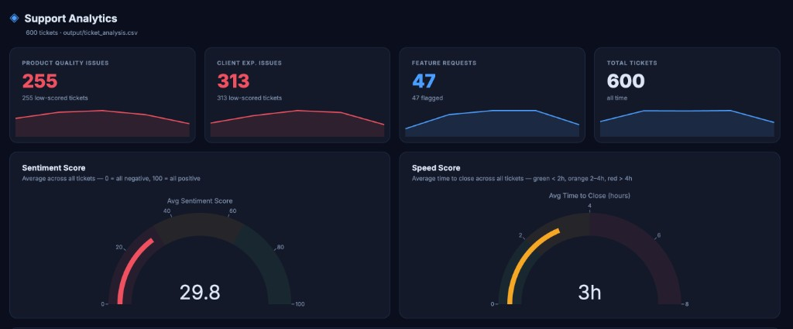
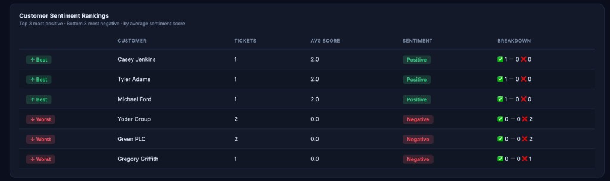
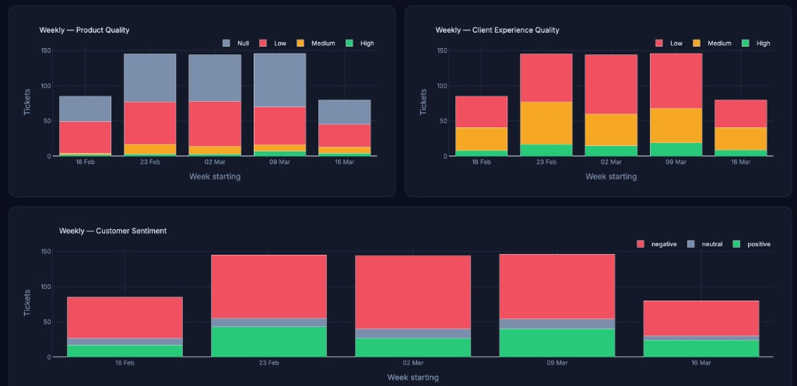
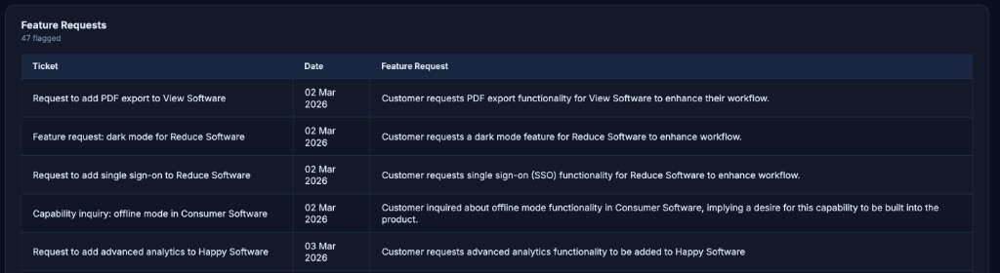

# CS Agent — HubSpot Support Analytics

An AI-powered pipeline that reads your HubSpot ticket export, runs each conversation through Claude to generate quality and sentiment scores, and serves a local dark-mode analytics dashboard.



---

## What it does

The pipeline has three tools:

1. **`classify_tickets.py`** — reads your HubSpot ticket CSV, sends each ticket transcript to Claude (Anthropic), and writes an enriched output CSV with the following scores per ticket:
   - **Feature request flag** — did this ticket contain a feature request?
   - **Product quality score** — High / Medium / Low / Null
   - **Client experience quality score** — High / Medium / Low
   - **Sentiment score** — positive / neutral / negative
   - **Speed percentile** — where this ticket's time-to-close sits relative to all other tickets (lower = faster)

2. **`meeting_notes.py`** — pulls Gemini meeting notes from Google Drive, looks up the matching Google Calendar event for attendee info, creates a HubSpot Call engagement associated with matching contacts, and drafts a follow-up email via Claude in Gmail.

3. **`dashboard.py`** — reads the enriched CSV and meeting notes JSON, then serves an interactive Dash dashboard at `http://localhost:8050`. The Meeting Notes tab has a **Refresh Call Notes** button that scans Drive for new notes and processes them live.

---

## Dashboard

### KPI cards + gauges

Four metric cards show headline numbers with weekly sparklines. Two gauges display the fleet-wide average sentiment and speed scores.


### Customer rankings

Ranks customers by average sentiment score and average time-to-close, highlighting the best and worst performers.



### Weekly trend charts

Stacked bar charts break down product quality, client experience quality, and customer sentiment by week.



### Feature requests

A searchable table of every ticket flagged as containing a feature request, with Claude's description of what was asked for.



---

## Requirements

- Python 3.10+
- An [Anthropic API key](https://console.anthropic.com/)
- A HubSpot ticket export CSV (see column format below)
- A HubSpot Private App token (for meeting notes → HubSpot)
- Google Cloud OAuth credentials (for Google Drive + Gmail)

---

## Setup

```bash
# 1. Clone the repo
git clone https://github.com/zensalaria/cs-agent.git
cd cs-agent

# 2. Install dependencies
pip install -r requirements.txt

# 3. Add your API keys
cp .env.example .env
# Open .env and fill in:
#   ANTHROPIC_API_KEY=sk-ant-...
#   HUBSPOT_ACCESS_TOKEN=pat-na1-...
```

### Google Cloud setup (for meeting notes)

1. Go to [Google Cloud Console](https://console.cloud.google.com/) and create a project (or use an existing one).
2. Enable the **Google Drive API**, **Gmail API**, and **Google Calendar API** under APIs & Services → Library.
3. Configure the **OAuth consent screen** (External type, add your email as a test user).
4. Create an **OAuth 2.0 Client ID** (type: Desktop app) under APIs & Services → Credentials.
5. Download the JSON file and save it as `credentials.json` in the project root.
6. The first time you run `meeting_notes.py`, a browser window will open for you to grant access. After that, a `token.json` is cached so you won't need to log in again.

---

## Running the pipeline

### Step 1 — classify tickets

```bash
python classify_tickets.py --tickets path/to/your_tickets.csv --output output/ticket_analysis.csv
```

The script resumes automatically if interrupted — already-classified rows are skipped on rerun. To start fresh:

```bash
python classify_tickets.py --tickets path/to/your_tickets.csv --no-resume
```

Optional: pass a products CSV to enable product quality scoring (see config below).

```bash
python classify_tickets.py --tickets path/to/tickets.csv --products path/to/products.csv
```

### Step 2 — process meeting notes

```bash
# Process the most recent Google Doc:
python meeting_notes.py

# Search for a specific doc by name:
python meeting_notes.py --file-name "Meeting notes - March 31"

# List recent Google Docs to pick from:
python meeting_notes.py --list
```

This will:
- Pull the Gemini notes from Google Drive
- Find the matching Google Calendar event and extract attendee emails
- Create a HubSpot Call engagement associated with matching contacts
- Draft a follow-up email (generated by Claude) in your Gmail drafts
- Save a summary to `output/meeting_notes.json` for the dashboard

You can also process new notes directly from the dashboard by clicking **Refresh Call Notes** on the Meeting Notes tab.

### Step 3 — launch the dashboard

```bash
python dashboard.py
```

Open `http://localhost:8050` in your browser.

---

## Input CSV column format

Export your tickets from HubSpot and make sure the CSV contains these columns (names must match exactly):

| Column | Description |
|--------|-------------|
| `Ticket ID` | Unique ticket identifier |
| `Ticket name` | Subject / title of the ticket |
| `query_transcript` | Full conversation transcript |
| `TTC_generated` | Time to close in `H:MM:SS` format |
| `Associated Company` | Company name (used for customer rankings) |
| `Associated Contact` | Contact name (fallback for rankings) |
| `generated create date` | Ticket creation date (used for weekly charts) |

Column names can be customised in `config.py` if your export uses different names.

### Optional: products CSV

If you want product quality scores, provide a CSV with at least two columns — a product name column and a category column. Point to it via `--products` and configure the column names in `config.py`:

```python
product_name_col: str = "product_name"
product_category_col: str = "category"
```

---

## Configuration

All settings live in `config.py` and can be overridden via CLI flags:

| Setting | Default | Description |
|---------|---------|-------------|
| `model` | `claude-sonnet-4-6` | Anthropic model to use |
| `max_tokens` | `1024` | Max tokens per Claude response |
| `max_retries` | `3` | Retries on API errors |
| `resume` | `True` | Skip already-classified rows |
| `limit` | `None` | Process only the first N rows (useful for testing) |

Example — test on the first 50 rows with a specific model:

```bash
python classify_tickets.py --tickets tickets.csv --limit 50 --model claude-opus-4-5
```

---

## Environment variables

| Variable | Where to get it |
|----------|----------------|
| `ANTHROPIC_API_KEY` | [console.anthropic.com](https://console.anthropic.com/) |
| `HUBSPOT_ACCESS_TOKEN` | HubSpot → Settings → Integrations → Private Apps |

---

## License

MIT
